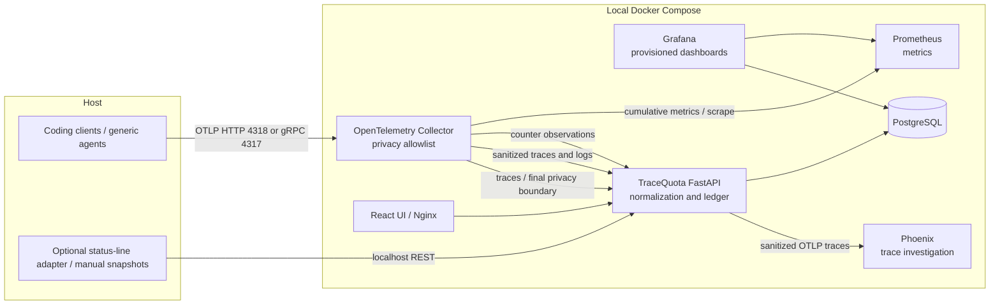

# Architecture

## Boundaries and structure
`apps/api/tracequota` contains the executable provider-neutral domain and telemetry modules. `packages/domain` and `packages/telemetry` document their interfaces; they are deliberately not separately packaged yet. A single Python application avoids fragile packaging/path configuration in the initial release. The frontend lives in `apps/web`; adapters in `integrations`; configuration in `infrastructure`; dashboards and examples are versioned. PostgreSQL stores tasks, normalized events, metric observations and quota snapshots. Alembic owns migrations and analytics views. Phoenix uses a separate named SQLite volume, which keeps its schema and upgrades independent from the ledger.

## Telemetry and accounting
Collector is the canonical entry point and scrubs content before **any** exporter. Native OTLP JSON and protobuf are accepted by the internal API. Metadata is allowlisted again at the ledger. A separate internal OTLP route on the API sanitizes scope attributes, span links, trace-state, span events and free-form names before forwarding protobuf traces to Phoenix. Collector retry handles relay failures; this forwards observability data only and never handles model-provider requests. Logs and trace spans sharing a provider/session/request ID represent one LLM request; late spans merge identifiers and agent attribution. Trace/span IDs preserve hierarchy for Phoenix. Input/output/cache-read/cache-write stay separate. Nullable canonical usage carries source/semantics provenance. Input is reduced by cache only when inclusive semantics are explicitly known and every needed quantity is measured. Generic missing/ambiguous counters remain partial. Do not add native counters to per-request totals. Counter observations go to a separate table and Prometheus; metric-only integrations can inspect those signals but cannot supply complete task details.

PostgreSQL advisory transaction locks serialize ledger writes across workers and make duplicate retries safe. Known explicit task IDs must match their client/session; a task may contain multiple providers. New execution IDs use workspace/client/session, with legacy request IDs retained for replay compatibility and collision handling across clients. V1 batches are bounded to 4 MiB and decompression is bounded. There is no message queue: Collector retries transient API failures for five minutes; an extended outage or Collector restart can lose in-flight telemetry. There is no durable Collector queue in V1.

## Task semantics
An explicit `tracequota.task.id` represents a manual task. `prompt.id` or an available trace ID represents an **interaction**, not a GitHub issue. An ID-less session is **session activity**. SessionStart/SessionEnd HTTP hooks can bracket session activity; they do not create fictitious feature boundaries. A completed interaction root establishes duration. Missing completion remains running, including after crashes; there is no fabricated timeout. Logs/spans without a shared ID cannot be safely deduplicated or fully correlated. Rich tool payloads are not required for basic accounting.

## Quota and costs
Snapshots are immutable evidence carrying provider, account, timestamp, source, optional session/task ID, demo flag and named windows. Matching uses the latest snapshot at/before start within 24 hours and first at/after completion within 15 minutes; those tolerances are visible here and may miss sparse captures. Sources remain attached. Delta is percentage points. Changed reset IDs/times, a reset occurring between captures or decreasing usage produce an explicit reset crossing and null delta. Simultaneous work can contribute to account-wide changes: delta is correlation, not causal allocation.

The official status-line adapter takes a documented provider payload; it does not retrieve credentials. Manual and capacity-based estimated providers are implemented. Experimental scraping is a disabled extension point. Never silently translate tokens to authoritative quota.

API-equivalent cost uses the active immutable JSON catalog and Decimal arithmetic. Each new model call freezes a component breakdown, rule ID, catalog hash, effective period, source and confidence. Missing telemetry/unsupported conditions yield null complete cost with known components separately summed. Missing cache TTL makes cache writes partial. Catalog sync is atomic/idempotent and never reprices historical events. Provider-reported cost and subscription bills remain separate. See [pricing architecture](docs/pricing/architecture.md) for conditions and usage semantics.

## Portability and trust
Only host OTLP/HTTP ingress crosses the boundary. Docker Compose owns all services; no Docker socket, privileged container, host network, native agent image or host-specific data directory is used. Local browser origin checks reject cross-site writes. Nginx restricts content, framing and payload sizes. Loopback listeners and read-only Grafana credentials constrain access. This is a single-user local tool, not a production LAN deployment or authentication service.

## Execution identity and additive migration

Client is independent of provider. Sessions record client/version/surface/runtime/integration type; tasks contain agent runs and provider-specific model/tool/MCP events. Safe raw and normalized metadata have PostgreSQL JSONB columns. Migrations 0003/0004 add these entities, indexed client/provider/model/rule fields and extended analytics views while preserving all original event pricing payloads and IDs. Unknown legacy client identity is not inferred from Anthropic provider alone. [Migration strategy](docs/migrations/multi-client-pricing.md).
