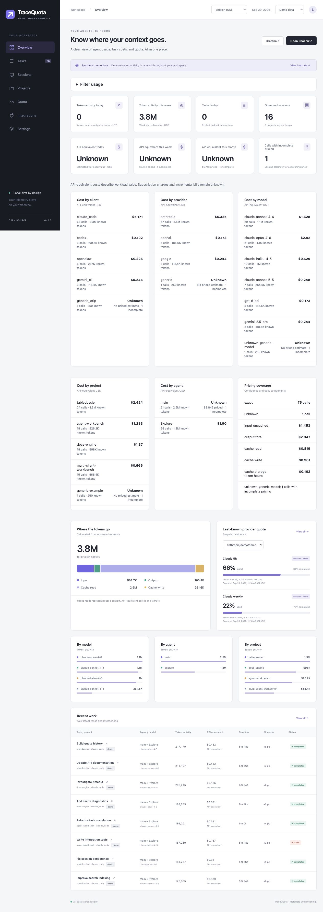

# TraceQuota

**Local-first observability and quota intelligence for AI coding agents.**

TraceQuota helps you understand which agent did the work, which models it called, how many tokens it used, what that workload would cost through an API, and how independently recorded quota changed. It keeps those answers in one local dashboard without a TraceQuota account or a hosted telemetry service.

Your coding clients run normally on the host. They export OpenTelemetry (OTLP) to a local Collector. TraceQuota filters metadata, stores an execution ledger in PostgreSQL, and connects it to Phoenix for traces and Grafana/Prometheus for charts. It does not proxy model requests or manage provider credentials.



Source code and documentation use English (en-US). The interface supports **English (US)** and **Português (Brasil)** through the header language selector, with localized dates/numbers and UTC time calculations. Monetary estimates always remain USD; switching language does not convert currency. The selection is stored in your browser. This initial repository is private; cloning requires access. The Apache-2.0 license is already in place for its eventual public release.

## Quickstart

Prerequisites: Git and a **running Docker engine** with Docker Compose v2.24 or later. Docker Desktop works on macOS/Windows; Docker Engine with the Compose plugin works on Linux. Colima is another macOS option. A Docker CLI without an engine is insufficient. No host Python, Node.js or provider account is needed to run the application.

```bash
git clone https://github.com/ruanpato/tracequota.git
cd tracequota
docker compose up -d --build --wait --wait-timeout 300
docker compose run --rm tracequota-doctor
```

The first startup downloads images, builds the application, migrates the database and imports bundled prices. An `.env` file is optional; defaults work. Open **[TraceQuota](http://localhost:8080)**. Grafana is at [localhost:3000](http://localhost:3000), Phoenix at [localhost:6006](http://localhost:6006), and Prometheus at [localhost:9090](http://localhost:9090). All published ports bind to `127.0.0.1`; PostgreSQL stays inside the Compose network.

Try a labeled synthetic workload without authenticating to a provider:

```bash
docker compose run --rm tracequota-demo
docker compose run --rm tracequota-smoke
```

Select **Demo data**. The fixture includes 25 tasks, 15 sessions, 75 model calls and 52 quota snapshots across Claude Code, Codex, OpenClaw and Gemini CLI. One task calls both OpenAI and Anthropic. Synthetic data verifies the pipeline; it does not prove that a native client is connected or expose real subscription quota.

See the [step-by-step Quickstart](docs/quickstart.md) for host platforms, health verification, a generic OTLP example and startup issues. Coding agents can follow its deterministic commands without installing language runtimes or changing provider authentication.

## Coding clients

| Client | Current integration and validation |
|---|---|
| [Claude Code](docs/integrations/claude-code.md) | Official metrics/events and optional beta traces documented; normalization and optional status-line adapter implemented; authenticated CLI/Desktop Local sessions still need validation |
| [Codex](docs/integrations/codex.md) | Official native OTel export documented; partial normalization; native session untested |
| [OpenClaw](docs/integrations/openclaw.md) | Official diagnostics OTel plugin documented; provider-dependent normalization; native session untested |
| [Gemini CLI](docs/integrations/gemini-cli.md) | Official native OTel export documented; partial normalization; native session untested |
| [Cursor](docs/integrations/cursor.md) | Local session/tool hooks; metadata adapter tested, native execution untested; no measured tokens/cost/quota |
| [Generic OTLP](integrations/generic-otel/README.md) | HTTP JSON/protobuf and gRPC via the Collector; synthetic integration tested |
| [GitHub Copilot CLI](docs/integrations/copilot-cli.md), [OpenCode](docs/integrations/opencode.md) | Planned experimental adapters/plugins; none shipped |

Client identity is separate from provider/model identity. An OpenClaw task can use several providers. Ordinary desktop Chat/Cowork, remote SSH and cloud sessions do not automatically inherit localhost CLI support. Missing native fields remain unknown or partial. The Integrations page offers copyable agent setup prompts. An optional [local configuration helper](docs/integrations/agent-setup.md) merges Claude Code/Codex settings with private backups. Read the client guide before enabling export, keep content logging disabled, and use **Live data** to verify genuine activity.

## What is collected and where it lives

The default pipeline retains timestamps; client/version/surface/runtime; project/repository/branch/commit labels; task/session/request/trace/span/agent IDs; model/provider/billing context; tool names; status/duration; known token quantities; cost-rule provenance; and sourced quota percentages/reset times. Safe source attributes and normalized metadata are retained together. Native counters are stored separately from model calls to avoid counting the same usage twice.

The Collector and API remove prompts, responses, source-file contents, shell output, tool arguments, arbitrary log bodies and unapproved attributes before persistence/export. Labels you supply can still contain sensitive information: do not put secrets in task titles, host names, repository URLs or permitted metadata. This is field-based filtering, not a universal secret scanner. Content capture is unsupported by default.

PostgreSQL stores the ledger, quota snapshots and pricing registry. Phoenix stores sanitized traces in its own SQLite volume. Prometheus stores time series; Grafana stores dashboard state. These use four named Docker volumes. Normal operation is local; image/dependency downloads, updates and optional audits use public registries. Read [privacy](docs/privacy.md) and [security](SECURITY.md) before changing network or capture settings.

## Understanding usage, costs and quota

- **Token usage:** nullable input total, uncached input, cache reads/writes, output and reasoning with semantic provenance. Unknown is not zero. Cache is subtracted only from a known inclusive counter; reasoning included in output is billed once.
- **Provider-emitted cost:** a separate observed value, which may itself be an estimate.
- **API-equivalent estimate:** the public API value of measured work under a versioned pricing rule. It is not a subscription invoice or incremental subscription charge.
- **Quota:** independent provider/account snapshots labeled official payload, manual or estimated. Task changes are percentage points, with reset crossings shown explicitly. Concurrent sessions can contribute to account-wide changes.

The [Git-managed registry](pricing/README.md) includes selected Anthropic, OpenAI and Google models, exact aliases, effective periods, cache TTL and explicit tier/context conditions. Decimal arithmetic freezes each call's component breakdown, source, rule ID and hash. Missing usage or unsupported models/platforms/rates leave complete costs unknown while showing known priced components. Sync never reprices history. Coverage is finite and begins at its documented verification date.

Settings shows pricing status and local synchronization. The CLI provides the same workflow:

```bash
docker compose run --rm tracequota-api python -m tracequota pricing validate
docker compose run --rm tracequota-api python -m tracequota pricing sync
docker compose run --rm tracequota-api python -m tracequota pricing status
```

## Configure, update and manage data

Defaults work without `.env`. To change ports or first-start passwords, copy `.env.example` to `.env` and edit it. See [configuration](docs/configuration.md). Grafana opens with Viewer access; its local administrator is `local` / `tracequota-local` by default. These documented localhost credentials must not be reused for Internet exposure. Changing a password variable does not rotate credentials in an initialized volume.

Stop or restart while preserving data:

```bash
docker compose down
docker compose up -d --wait --wait-timeout 300
docker compose run --rm tracequota-doctor
```

Update from a clean checkout after backing up PostgreSQL and the other volumes:

```bash
git pull --ff-only
docker compose up -d --build --wait --wait-timeout 300
docker compose run --rm tracequota-doctor
```

Updates apply migrations and sync bundled prices. Review the [changelog](CHANGELOG.md) and [backup/update guide](docs/configuration.md) first; migrations can limit rollback. No TraceQuota images are published: application images build from this repository.

To remove containers, use `docker compose down`. **`docker compose down -v` permanently deletes all four local data volumes**; use it only to deliberately erase history. Deleting the checkout alone does not erase Docker volumes. No automatic retention policy is implemented.

## Architecture and repository

The seven-service stack combines Collector, API, web, PostgreSQL, Phoenix, Prometheus and Grafana. The canonical graph is workspace → project/repository and client session → task → agent run → model/tool event. Quota stays provider/account evidence. Eleven added panels extend the original dashboard to 34, with independent client/provider/model/project/agent filters.

See [architecture](ARCHITECTURE.md), [repository map and documentation index](docs/README.md), [pricing semantics](docs/pricing/architecture.md) and [migration notes](docs/migrations/multi-client-pricing.md).

## Development and contributions

Start with [CONTRIBUTING.md](CONTRIBUTING.md) and [development setup](docs/development.md). New models/rates usually require reviewed JSON catalog changes and manually calculated examples; use the [pricing contribution guide](docs/pricing/contributing.md). New clients need explicit identity, safe normalization fixtures, honest capability labels and onboarding. New providers must separate model service from billing platform and quota source. Do not copy credentials, private traces or undocumented integrations into fixtures.

Tests cover privacy, usage, pricing/history, client collisions, mixed-provider accounting, quotas, migrations and full-ledger aggregation. CI checks portable backend/frontend tests, PostgreSQL, container acceptance, dependencies and image builds. Real-client authentication tests are separate from synthetic validation. See the [dependency/UI follow-up](docs/hardening-report.md) and [initial release-readiness report](docs/release-readiness.md) for observed results and limits; older implementation reports are historical evidence.

## License and project policies

Copyright 2026 Ruan Pato. Licensed under [Apache-2.0](LICENSE); see [NOTICE](NOTICE). [Security policy](SECURITY.md), [contribution guide](CONTRIBUTING.md), [code of conduct](CODE_OF_CONDUCT.md) and [roadmap](ROADMAP.md).
